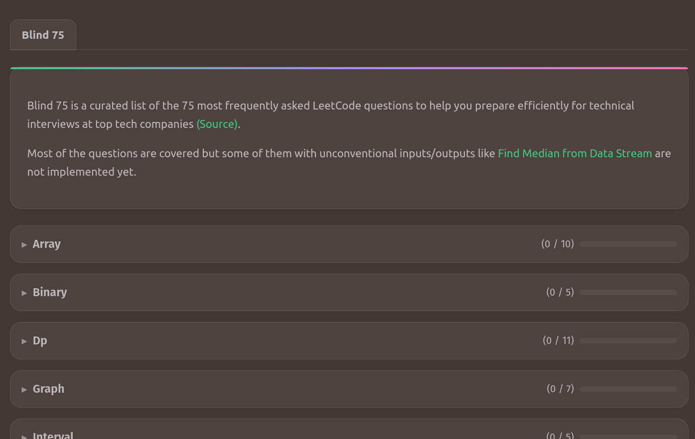

> Self-contained, open-source offline code judge with personalized tracker for LeetCode-style problems — powered by Docker.




## Highlights

- Offline-first: judge solutions without an internet connection
- Docker sandboxes: consistent, isolated runs across machines
- LeetCode-style problem packs with statements and tests
- Simple & fast web UI (SvelteKit) with in-browser editor
- Multiple languages support (Java/Python/C++)
- Extensible: add new problems by dropping folders in `problems/`
- Persistent Code & Progress Tracking via Local Storage

## Requirements

- Docker (installed and running)
- Node.js and npm (for development only)

## Quickstart

- Linux/macOS
```bash
./run.sh
```

- Windows (PowerShell)
```powershell
./run.ps1
```

This builds the image, starts the container, and prints the link: http://localhost:5375

## Development

1) Add $USER to docker group
```bash
sudo usermod -aG docker "$USER"
newgrp docker
```

2) Install dependencies
```bash
npm install
```
3) Start the app (dev)
```bash
npm run dev
```

## Add a problem

Create a new folder under `problems/<your-problem-slug>/` with:

- `statement.md` – problem description (Markdown)
- `metadata.json` – problem metadata
- `official-tests.json` – input/output pairs
- `Marker.java` – The judger program to determine if an output is correct or not and to give one correct solution. It has to be written in java and called `Marker.java`. No `Marker.py` or `Marker.cpp` are needed. 

Refer to `/problems/two-sum` for a detailed example.

#### Note on problems

Some test cases and reference marker solutions were AI‑assisted and human‑reviewed. Issues may remain—please open an issue or PR if you spot anything.

The prompt that was given to copilot for generating problems:
1. With CSV data for adding multiple problems.
```plaintext
Refer to /problems/two-sum, please add the following problems:
Category,Title,Description,Link
[problem1_category],[problem1_title],[problem1_description],[problem1_link]
[problem2_category],[problem2_title],[problem2_description],[problem2_link]
...
```

2. With a screenshot
```plaintext
Refer to /problems/two-sum, please add the problem shown in the image.
[pasted image] 
```

## Add a programming language

This is a more complicated process but it is definitely doable. 

1. For starter you need to create a new class that extends class `ProgramRunner.ts` (e.g. `JavascriptRunner.ts`) and implement your own `abstract compile()` and `abstract run()`. It's expected that all runtimes will be executed via [Dockerode](https://github.com/apocas/dockerode)

2. Implement all the `displayOutput({inputType})` and `to_{inputType}()` methods on your custom utilitiy class (e.g. `javascriptUtil.ts`)

3. Add your new languages on `api/image/pull` and `api/image/status` 

4. Add `starterCode` to the problem you like to solve in your language. Just the starter code is needed for existing problems. No need for solution in the new language. Our codebase will handle the rest.

5. Update `type ProgrammingLanguage = 'java' | 'python' | 'cpp' | 'your_new_lang'` on `util.ts`;

6. Add a new `<option>` on the UI for the new language in `#language-select`

Refer to `javaUtil.ts`, `JavaRunner.ts` and `problems/two-sum` for a detailed example. 