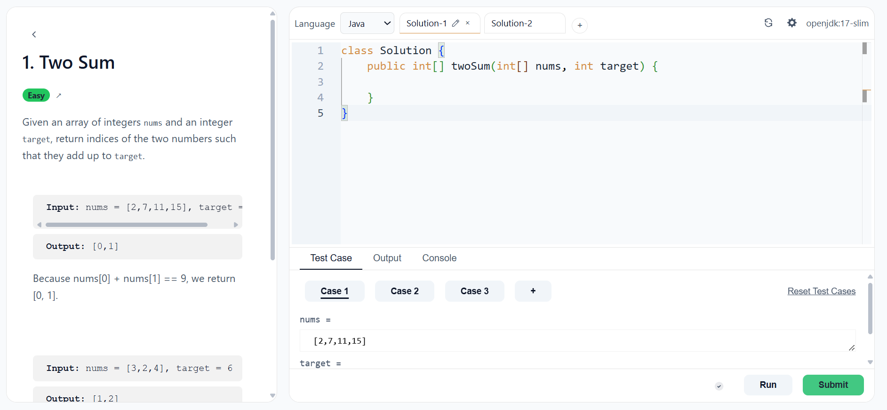
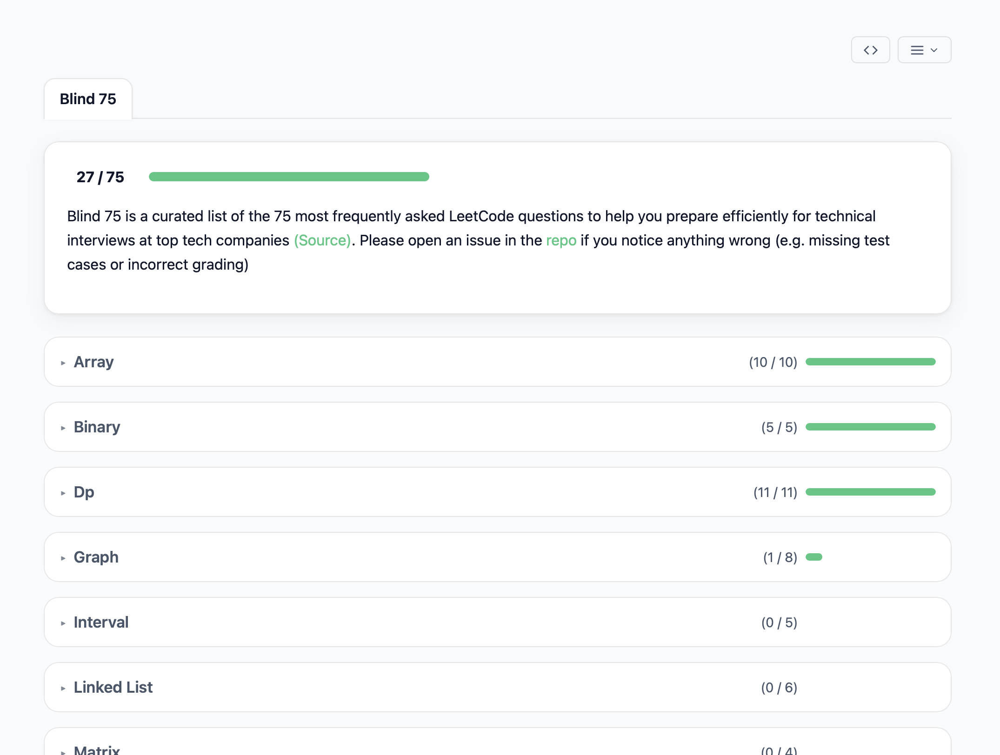

> Solve classic algorithmic problems without the internet or having to deal with installing runtimes. No discussion forum, no LLM assistant, not even the internet. Solve the curated list with just you, the problem and the judge.






### Demo site: [https://cojudge.cloud](https://cojudge.cloud)

## Highlights

- Offline-first: judge solutions without an internet connection
- Docker sandboxes: consistent, isolated runs across machines
- LeetCode-style problem packs with statements and tests
- Simple & fast web UI (SvelteKit) with in-browser editor and light/dark mode support
- Multiple languages support (Java/Python/C++)
- Code Playground: Run code snippets in Java, Python, or C++ without a problem context
- Extensible: add new problems by dropping folders in `problems/`
- Persistent Code & Progress Tracking via Local Storage
- Browser-like tabs to organize your local solutions
- Extensive problems: includes 60+ problems with sample testcases and hidden testcases from Blind 75

## Requirements

- Node.js (v18+) and npm
- Docker (installed and running, only required while judging)

## Quickstart

### 1. Installation
The easiest way to install CoJudge without dealing with NPM permission issues is to run our install script:

#### Mac / Linux
```bash
git clone https://github.com/cojudge/cojudge
cd cojudge
./install.sh
source ~/.zshrc # or ~/.bashrc, depending on your shell
```

#### Windows Powershell
```powerhshell
git clone https://github.com/cojudge/cojudge
cd cojudge
./install.ps1
. $PROFILE
```

This will install dependencies, build the app, and add a `cojudge` alias to your shell configuration.

### 2. Usage
Simply run `cojudge` to start the server and open it in your browser:
```bash
cojudge
```

### CLI Commands
| Command | Description |
| --- | --- |
| `cojudge` | Start server & open browser |
| `cojudge <slug> <file>` | Open specific problem in browser with local file |
| `cojudge run <slug> <file>` | Run sample tests for a problem from CLI (require running Docker) |
| `cojudge submit <slug> <file>`| Submit code for a problem from CLI (require running Docker) |
| `cojudge run <file>` | Run a playground file from CLI (require running Docker) |
| `cojudge list` | List all available problem slugs |
| `cojudge mark <slug>` | Mark a problem as solved |
| `cojudge unmark <slug>` | Unmark a problem as solved |
| `cojudge -p, --port <port>` | Start server on specific port (default 5375) |
| `cojudge -s, --status` | Check if server is running |
| `cojudge -u, --update` | Update to latest version (git pull) |
| `cojudge -l, --logs` | Stream the server logs |
| `cojudge -k, --kill` | Stop the server |
| `cojudge -v, --version` | Show current version & age |
| `cojudge -h, --help` | Show help message |

**Note:** You can browse problems and organize solutions without Docker. Docker is only required when you actually want to `Run` or `Submit` code, either from the web UI or CLI.

### Manual Global Installation (If you prefer)
If you'd rather install it globally via NPM and have the necessary permissions:
```bash
npm install -g .
```

### Troubleshooting Installation (Permission Denied)

If you encounter an `EACCES` error when running `npm install -g .` (especially on macOS with Homebrew), it's likely because your user doesn't have permissions to write to the global `node_modules` folder.

You can fix this by either:
1. **Using sudo** (not recommended but fast):
   ```bash
   sudo npm install -g .
   ```
2. **Fixing npm permissions** (recommended): Follow the [official npm guide](https://docs.npmjs.com/resolving-eacces-permissions-errors-when-installing-packages-globally) to change npm's default directory.
3. **Using the install script** (easiest): Use `./install.sh` as described in the Quickstart section.

## Alternative: Manual Run
If you don't want to install the CLI:
```bash
chmod +x run.sh
./run.sh
```
This starts the app at: http://localhost:5375.

## Running with Docker (Containerized)

If you prefer to run the entire application inside a Docker container:
```bash
chmod +x docker.sh
./docker.sh
```
This builds a local image named `cojudge` and runs it, mapping the host Docker socket so the judge can spawn sibling containers.

## Development

1) Add $USER to docker group (if using Docker)
```bash
sudo usermod -aG docker "$USER"
newgrp docker
```

2) Install dependencies
```bash
npm install
```
3) Start the app (dev)
```bash
npm run dev
```

## Add a problem

Create a new folder under `problems/<your-problem-slug>/` with the following files:

1. `statement.md` – problem description in Markdown
2. `metadata.json` – problem metadata (difficulty, input structure, starter code, etc.)
3. `official-tests.json` – an array of inputs for the official tests that will run when user clicks `Submit`. Only inputs are needed. **No need to write the expected output**. Our code will get the expected output by passing your input to your `Marker.java`
4. `Marker.java` – The judger class should contain two public methods:

  4.1. `{outputType} {functionName}(testcase)` that gives the correct solution. `{functionName}` is what you defined in `metadata.json`. This is the correct solution that can pass the LeetCode judge in Java. You can usually find a Java solution on the LeetCode discussion forum pretty easily for any problem. The judger has to be written in Java and called `Marker.java`. **No** `Marker.py` or `Marker.cpp` are needed.

  4.2. `boolean isCorrect(testcase, userOutput)` that judges if a user output is correct for the given testcase.

5. Add the problem to `courses/blind75/courseinfo.json`

Refer to `/problems/two-sum` for a detailed example.

#### Note on problems

Some test cases and reference marker solutions were AI‑assisted and human‑reviewed. Issues may remain—please open an issue or PR if you spot anything.

The prompt that was given to copilot for generating problems:
1. With CSV data for adding multiple problems.
```plaintext
Refer to /problems/two-sum, please add the following problems:
Category,Title,Description,Link
[problem1_category],[problem1_title],[problem1_description],[problem1_link]
[problem2_category],[problem2_title],[problem2_description],[problem2_link]
...
```

2. With a screenshot
```plaintext
Refer to /problems/two-sum, please add the problem shown in the image.
[pasted image] 
```

## Add a programming language

This is a more complicated process but it is definitely doable. 

1. For starter you need to create a new class that extends class `ProgramRunner.ts` (e.g. `JavascriptRunner.ts`) and implement your own `abstract compile()` and `abstract run()`. It's expected that all runtimes will be executed via [Dockerode](https://github.com/apocas/dockerode)

2. Implement all the `displayOutput({inputType})` and `to_{inputType}()` methods on your custom utilitiy class (e.g. `javascriptUtil.ts`)

3. Add your new languages on `api/image/pull` and `api/image/status` 

4. Add `starterCode` to the problem you like to solve in your language. Just the starter code is needed for existing problems. No need for solution in the new language. Our codebase will handle the rest.

5. Update `type ProgrammingLanguage = 'java' | 'python' | 'cpp' | 'your_new_lang'` on `util.ts`;

6. Add a new `<option>` on the UI for the new language in `#language-select`

7. Create a new class that extends `PlaygroundRunner` (e.g. `PlaygroundJavascriptRunner`) in `src/lib/runners/PlaygroundRunners.ts` and add the instantiation logic in `src/routes/api/playground/run/+server.ts`.

Refer to `javaUtil.ts`, `JavaRunner.ts` and `problems/two-sum` for a detailed example. 

## Troubleshooting

### Error Connecting to Docker on macOS with Colima

Some Docker environments on macOS (like Colima) use a non-default Docker socket path. If the application has trouble connecting to Docker, you can specify the path manually by setting the `HOST_DOCKER_SOCKET` environment variable.

**Example:**
```bash
# Find your socket path by running `colima status`
HOST_DOCKER_SOCKET="/Users/your-user/.colima/default/docker.sock" ./docker.sh
```

## Contact

Feel free to use the [Issue page](https://github.com/cojudge/cojudge/issues) or [Discussion page](https://github.com/cojudge/cojudge/discussions) for any issues, feedback, comments, feature requests, or anything else related to cojudge. If you would rather reach out privately, contact me [here](https://waiyip.life/#contact); I'll respond as soon as I can.
